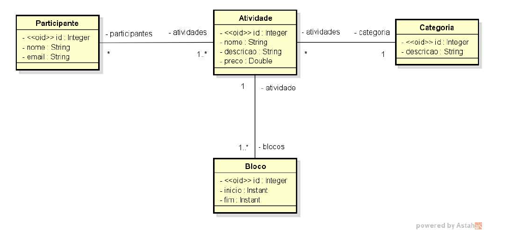
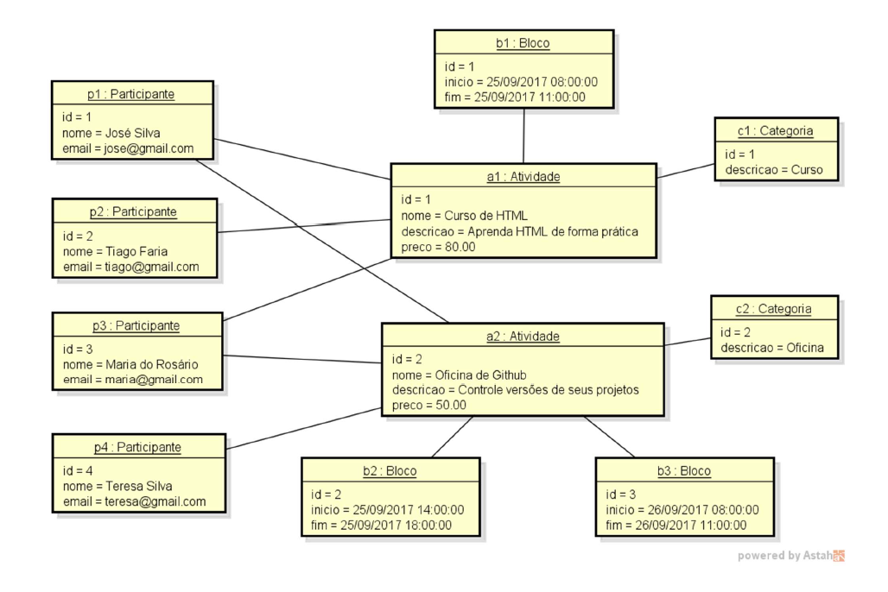

# Sobre o desafio

Deve-se criar um projeto no Spring Boot com Java e banco de dados H2, e implementar o modelo conceitual conforme especificação a seguir. Além disso, deve-se fazer o seeding da base de dados, conforme diagrama de objetos que segue.

## ESPECIFICAÇÃO - Sistema EVENTO

Deseja-se construir um sistema para gerenciar as informações dos participantes das atividades de um evento acadêmico. As atividades deste evento podem ser, por exemplo, palestras, cursos, oficinas práticas, etc. Cada atividade que ocorre possui nome, descrição, preço, e pode ser dividida em vários blocos de horários (por exemplo: um curso de HTML pode ocorrer em dois blocos, sendo necessário armazenar o dia e os horários de início de fim do bloco daquele dia). Para cada participante, deseja-se cadastrar seu nome e email.



### Instância dos dados para seeding



## Créditos

Este desafio faz parte do curso **Java Spring Professional** da **Devsuperior**, ministrado pelo Prof. Dr. **Nélio Alves**, que visa trabalhar:

- Implementação de entidades de domínio
- Mapeamento objeto-relacional com JPA
- Setup de projeto Spring Boot para banco H2
- Seeding de base de dados H2

## Como executar o desafio

---

*Pré-requisitos*: 

- Tecnologias: Java 21, Maven 3
- Programas: 
  - Terminal (ex.: Git Bash, Windows PowerShell, Prompt de comandos do Windows)
  - (opcional) IDE (ex.: Intellij IDEA), ou editor de texto (ex.: VS Code)
  - Navegador web

---

Abra um terminal de sua preferência, como o Git Bash, e execute os comandos a seguir:

````
# clonar repositório (via HTTPS)
git clone https://github.com/jonatasmateus/bds-java-spring-desafio-2

# entrar na pasta do desafio
cd bds-java-spring-desafio-2

# executar o projeto
./mvnw spring-boot:run
````

---

Caso tenha e opte por usar alguma IDE ou editor de texto instalado, certifique-se de ter o projeto clonado e execute o projeto dentro da IDE ou editor de texto.

### Para checar o seeding da base de dados

Abra um navegador web de sua preferência, digite a seguinte URL `http://localhost:8080/h2-console/`, logue o banco H2 conforme as especificações do arquivo application-test.properties e clique em cada tabela com o comando SELECT para checar o seeding. 

## Autor

Jonatas Mateus Souza

LinkedIn: www.linkedin.com/in/jonatasmateus 
